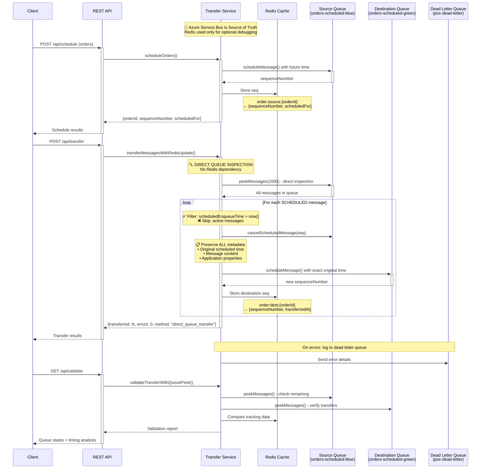

# Azure Service Bus Message Transfer

Spring Boot application for transferring scheduled messages between Azure Service Bus queues with simplified direct queue inspection approach.

## Architecture Overview



## Quick Start

### Prerequisites
- Java 17+
- Azure Service Bus (3 queues: source → destination + dead letter)
- Redis (local or Azure Cache) - **Optional for debugging**

### Setup
```bash
# 1. Clone and setup
git clone https://github.com/ShanmugaSivapragasam/message-transfer.git
cd message-transfer
./setup-local.sh

# 2. Configure credentials
cp env.example .env
# Edit .env with your Azure Service Bus and Redis credentials

# 3. Start Redis (optional - only for debugging/tracking)
brew install redis && brew services start redis

# 4. Run application
./run-app.sh
```

### Test the API
```bash
# Health check
curl http://localhost:8080/api/health

# Schedule 5 orders to source queue (scheduled for 5am tomorrow)
curl -X POST "http://localhost:8080/api/schedule?count=5&delaySeconds=54000"

# 🎯 SIMPLIFIED TRANSFER: Direct queue inspection (no Redis dependency)
curl -X POST http://localhost:8080/api/transfer

# Transfer with metadata logging (max 10 samples for testing)
curl -X POST "http://localhost:8080/api/transfer?printMetadata=true"

# Transfer without storing destination tracking in Redis
curl -X POST "http://localhost:8080/api/transfer?cleanupSource=false"

# Debug: Check what messages are actually in queues
curl "http://localhost:8080/api/validate?peek=20"

# Enhanced validation with timing preservation analysis
curl "http://localhost:8080/api/validate?peek=10&includeTimings=true"

# Check transfer status and queue summary
curl http://localhost:8080/api/transfer/status

# Check order status (if Redis tracking available)
curl http://localhost:8080/api/order/ORD-2025-10-01-000001

# Cancel specific order
curl -X POST http://localhost:8080/api/cancel/ORD-2025-10-01-000001

# ⚠️ DANGER: Completely clean up ALL queues (scheduled + active + dead letter)
curl -X DELETE http://localhost:8080/api/cleanup

# Debug Redis state (optional tracking data)
curl http://localhost:8080/debug/redis/stats
```

## Core Features

### 🎯 ** Architecture**
- **Direct Queue Inspection**: Always peek Azure Service Bus source queue directly
- **No Redis Dependency**: Transfer works regardless of Redis state
- **Scheduled Messages Only**: Automatically filters and processes only future-scheduled messages
- ** Preservation**: Maintains exact timing, content, and metadata

### 🔄 **Transfer Logic**
- **Source of Truth**: Azure Service Bus queues (not Redis tracking)
- **Safe Transfer**: Cancel source → preserve all metadata → reschedule to destination
- **Active Message Handling**: Completely ignores active messages (logs and skips)
- **Error Resilience**: Continues processing even if individual messages fail

### 📊 **Optional Redis Tracking**
- **Purpose**: Debugging and sequence number tracking only
- **Not Required**: Transfer works without Redis data
- **Graceful Degradation**: Handles Redis failures transparently

### 🔄 **Batched Processing for Large Message Sets**
- **Azure Service Bus Peek Limit**: ~256 messages per peek operation
- **Batching Strategy**: Processes messages in 250-message batches
- **Large Scale Support**: Handles up to 50,000 messages by default (configurable)
- **Memory Efficient**: Processes batches sequentially, not all at once
- **Progress Tracking**: Logs batch progress for monitoring large transfers

#### Batch Processing Details:
```bash
# Example for 30,000 messages:
Batch 1: sequences 1-250 (250 messages)
Batch 2: sequences 251-500 (250 messages)  
...
Batch 120: sequences 29,751-30,000 (250 messages)

# Result: All 30,000 messages processed (120 batches × 250 messages)

# For 100k+ messages, use configuration or multiple calls:
app.transfer.maxMessages=100000  # Increase limit
# OR
# Multiple transfer calls for operational control
```

## Redis Data Structure (Optional Debug Info)
```
order:source:{orderId}       → source sequence numbers (scheduling phase)
order:dest:{orderId}         → destination sequence numbers (post-transfer)  
transfer:history:{orderId}   → transfer audit trail
archive:source:{orderId}     → archived source data
```

## API Endpoints

| Method | Endpoint | Description | Redis Required |
|--------|----------|-------------|----------------|
| GET | `/api/health` | Health check | ❌ No |
| POST | `/api/schedule` | Schedule orders to source queue | ❌ No (optional tracking) |
| POST | `/api/transfer` | **Direct queue transfer** - Azure Service Bus source of truth | ❌ No |
| POST | `/api/transfer?printMetadata=true` | Transfer with metadata logging (max 10 samples) | ❌ No |
| POST | `/api/transfer?cleanupSource=false` | Transfer without storing destination tracking | ❌ No |
| POST | `/api/cancel/{orderId}` | Cancel specific order | ⚠️ Needs Redis tracking |
| GET | `/api/order/{orderId}` | Get order status and transfer history | ⚠️ Needs Redis tracking |
| GET | `/api/transfer/status` | Queue summary and transfer status | ❌ No |
| GET | `/api/validate` | Queue validation with direct peek | ❌ No |
| GET | `/api/validate?includeTimings=true` | Enhanced validation with timing analysis | ❌ No |
| DELETE | `/api/cleanup` | **⚠️ DANGER**: Empty ALL queues (scheduled + active + dead letter) | ❌ No |
| GET | `/debug/redis/stats` | Redis state summary | ✅ Yes |

## Environment Variables

```bash
# Azure Service Bus (Required)
AZURE_SERVICEBUS_SOURCE_CONNECTION_STRING="Endpoint=sb://your-namespace.servicebus.windows.net/;SharedAccessKeyName=..."
AZURE_SERVICEBUS_DEST_CONNECTION_STRING="Endpoint=sb://your-namespace.servicebus.windows.net/;SharedAccessKeyName=..."
AZURE_SERVICEBUS_ERROR_CONNECTION_STRING="Endpoint=sb://your-namespace.servicebus.windows.net/;SharedAccessKeyName=..."

# Queue Names
app.source.queue.name=orders-scheduled-blue
app.dest.queue.name=orders-scheduled-green  
app.error.queue.name=poc-dead-letter

# Redis (Optional - for debugging/tracking only)
SPRING_DATA_REDIS_HOST=localhost                    # or Azure Cache host
SPRING_DATA_REDIS_PORT=6379                         # or 6380 for Azure
SPRING_DATA_REDIS_PASSWORD=""                       # empty for local
SPRING_DATA_REDIS_SSL_ENABLED=false                 # true for Azure

# Application Settings
app.defaultScheduleDelaySeconds=3600                # Default delay when scheduling
app.transfer.maxMessages=50000                      # Maximum messages per transfer (default: 50,000)
```

## Transfer Behavior

### ✅ **What Gets Transferred**
- Messages with `scheduledEnqueueTime` > current time
- ALL metadata and application properties preserved
- Exact original scheduled timing maintained
- Complete message payload preserved

### 📊 **Scale Limits**
- **Default Maximum**: 50,000 messages per transfer operation
- **Configurable**: Set `app.transfer.maxMessages` to adjust limit
- **Large Scale Strategy**: For 100k+ messages, use multiple transfer calls
- **Memory Efficient**: Processes in 250-message batches regardless of total

### ❌ **What Gets Skipped**
- Active messages (no future scheduled time)
- Messages already delivered/consumed
- Invalid or corrupted messages (logged as errors)

### 🔍 **Transfer Process**
1. **Batched Queue Peek**: Inspect source queue in 250-message batches (Azure Service Bus limit)
2. **Large Scale Processing**: Handles up to 10,000 messages across multiple batches
3. **Filter Scheduled**: Only process messages scheduled for future delivery
4. **Cancel & Transfer**: Cancel source, preserve everything, reschedule to destination
5. **Optional Tracking**: Store destination sequence in Redis for debugging
6. **Error Handling**: Log failures to dead letter queue, continue processing
7. **Progress Monitoring**: Log batch progress for large message sets

### 📊 **Performance Characteristics**
- **Batch Size**: 250 messages per Azure Service Bus peek operation
- **Default Maximum**: 50,000 messages per transfer (configurable)
- **Memory Usage**: Processes batches sequentially, not all messages at once
- **Scalability**: Linear processing time based on number of scheduled messages
- **Reliability**: Continues processing even if individual batches fail

#### Large Message Set Examples:
```bash
# Transfer 30,000 scheduled messages (within default limit):
curl -X POST http://localhost:8080/api/transfer
# Result: All 30k messages transferred in 120 batches

# Transfer 100,000 messages (exceeds default limit):
# Option 1: Increase limit via configuration
app.transfer.maxMessages=100000

# Option 2: Multiple transfer calls
curl -X POST http://localhost:8080/api/transfer  # Transfers first 50k
curl -X POST http://localhost:8080/api/transfer  # Transfers remaining 50k

# Option 3: Check remaining and repeat
curl http://localhost:8080/api/transfer/status   # Check how many remain
curl -X POST http://localhost:8080/api/transfer  # Transfer next batch
```

## Deployment

Ready for Azure Functions Flex Consumption. See `functions/` folder for HTTP trigger examples.

Optional Terraform infrastructure templates in `infra/` folder.

## Troubleshooting

### Transfer Issues
```bash
# Check what messages are actually in source queue
curl "http://localhost:8080/api/validate?peek=50"

# Verify transfer behavior with metadata logging
curl -X POST "http://localhost:8080/api/transfer?printMetadata=true"

# Check application logs for batch processing progress:
# - DIRECT_SCHEDULED_FOUND and DIRECT_TRANSFER_SUCCESS
# - "Peeking batch starting from sequence X"
# - "Completed batched peek operation - total messages examined: N"
```

### Large Message Set Issues
```bash
# For transfers stopping early (e.g., 250 of 5000 messages):
# 1. Check if Azure Service Bus peek limit was hit
# 2. Verify batching is working in logs
# 3. Look for "Moving to next batch starting from sequence X"

# Example log patterns for successful large transfers:
# "Peeking batch starting from sequence 1, batch size 250, total peeked so far: 0"
# "Moving to next batch starting from sequence 251, batch processed: 250"
# "Completed batched peek operation - total messages examined: 5000, transferred: 5000"
```

### Redis Issues
```bash
# Transfer works without Redis - verify
curl -X POST http://localhost:8080/api/transfer

# Check Redis connection (optional)
curl http://localhost:8080/debug/redis/stats
```

